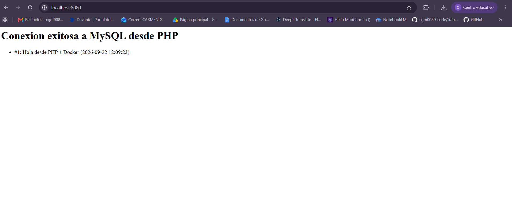

Los servicios

- **web**: nginx, sirve en el puerto 8080 y reenvia peticiones .php a php-fpm.
- **php**: PHP 8.3-fpm con la extension pdo_mysql instalada.
- **db**: MySQL 8.0, con base de datos `appdb` creada automaticamente.


```bash
docker compose up -d
```

A continuación, abre http://localhost:8080

El resultado es:


